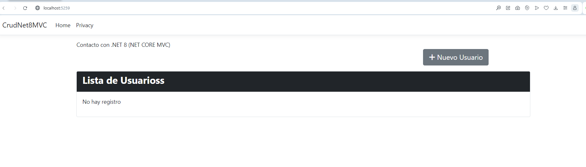
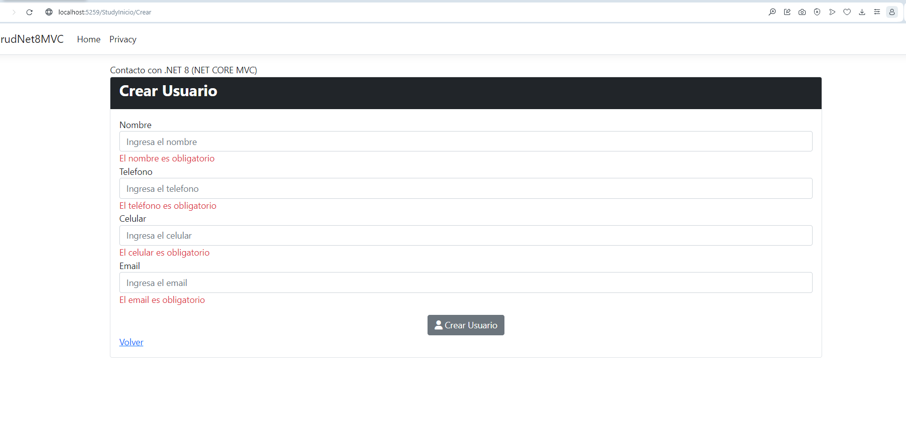
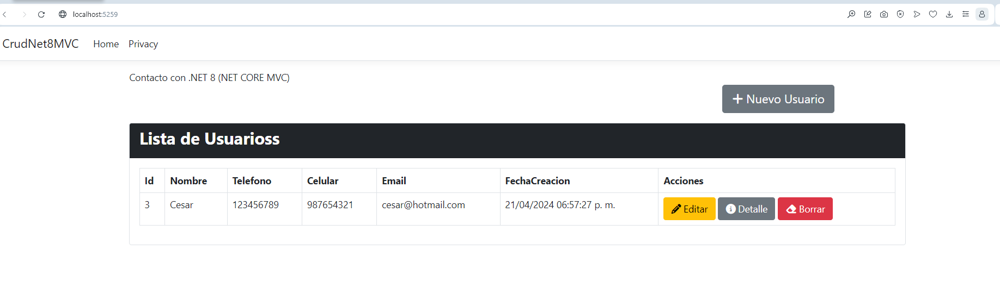
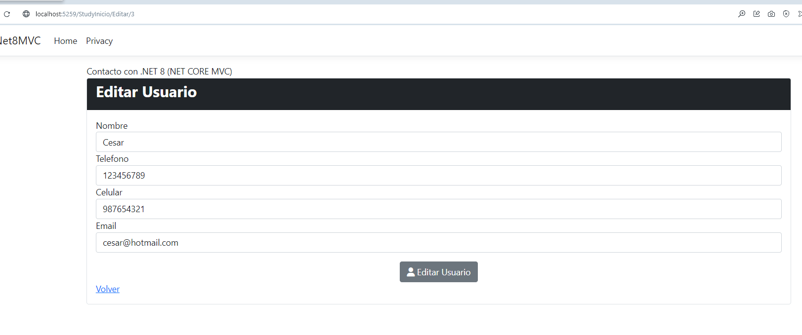
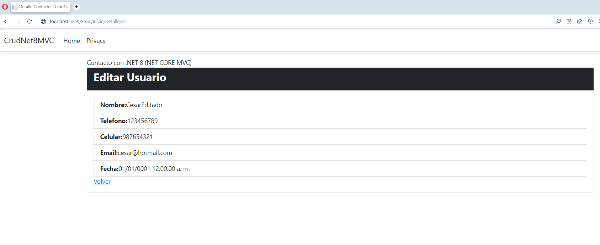
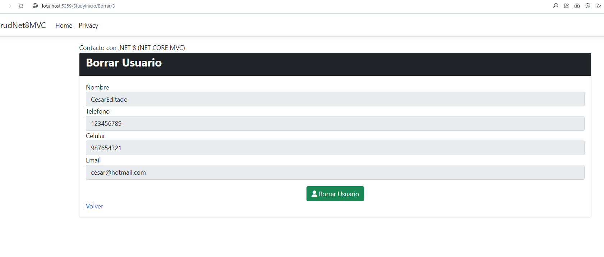

# UDY-MasterAspNetMvc-01CrudNetMVC

Para ahorrar tiempo de lo que ya conocia, me traje el Repo de Udemy, y cree nuevos controladores para ir practicando.

**Toda la documentacion la pueden encontrar en la siguiente liga.**
https://docs.google.com/document/d/e/2PACX-1vRKcJD8qOkCT4hYTgdH5bEMPtP54TE2pMzk47F_yNbH2le8yJcSh8n26hvo5M_3Qda3H49dtDKZSkI3/pub

## Imagenes Demo de la aplicacion

### Pantalla Inicial sin registros

### Pantalla crear nuevo Usuario

### Pantalla Inicial con Registros

### Pantalla Editar

### Pantalla Detalles

### Pantalla Borrar

